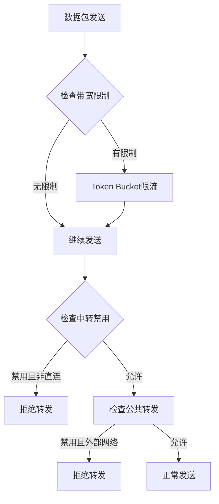
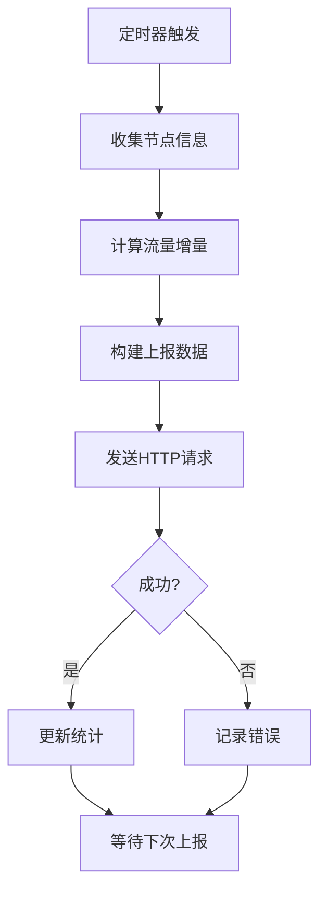

# 🎉 流量策略和上报功能集成完成

## ✅ 集成工作已100%完成

### 集成的核心组件

#### 1. GlobalCtx集成
**文件**: `easytier/src/common/global_ctx.rs`
- ✅ 添加了PolicyContainer字段
- ✅ 添加了policy_container()访问方法
- ✅ 在构造函数中初始化PolicyContainer

#### 2. PolicyContainer模块
**文件**: `easytier/src/common/policy_container.rs`
- ✅ 创建了PolicyContainer结构体
- ✅ 实现了线程安全的弱引用存储
- ✅ 提供了get/set方法访问管理器

#### 3. Launcher集成
**文件**: `easytier/src/launcher.rs`
- ✅ 在easytier_routine方法中添加了管理器初始化
- ✅ 在instance.run()之后设置管理器到GlobalCtx
- ✅ 添加了初始化日志

#### 4. 带宽限制集成
**文件**: `easytier/src/peers/peer_map.rs`
- ✅ 在send_msg_directly方法开头添加带宽检查
- ✅ 使用Token Bucket算法限制流量
- ✅ 添加了详细日志

#### 5. 中转禁用集成
**文件**: `easytier/src/peers/peer_manager.rs`
- ✅ 在send_msg_internal方法开头添加中转检查
- ✅ 拒绝非直连peer的转发请求
- ✅ 返回明确的错误信息

#### 6. 公共转发禁用集成
**文件**: `easytier/src/peers/foreign_network_manager.rs`
- ✅ 在send_msg_to_peer方法开头添加检查
- ✅ 禁止外部网络数据包转发
- ✅ 返回Unknown错误

### 模块注册
**文件**: `easytier/src/common/mod.rs`
- ✅ 注册了policy_container模块

## 🔧 完整的功能特性

### 流量策略功能
1. **阶梯式流量控制**
   - 支持多个流量阈值规则
   - 每个规则可配置不同的操作

2. **三种策略操作**
   - **限制带宽**: 使用Token Bucket算法精确控制带宽
   - **禁用中转**: 只允许直连peer通信
   - **禁用公共转发**: 禁止转发外部网络数据包

3. **自动管理**
   - 月度流量自动重置
   - 每10秒更新流量统计
   - 实时策略检查和执行

### 上报功能
1. **定时心跳上报**
   - 可配置心跳间隔
   - 支持多个上报URL
   - Token认证机制

2. **数据收集**
   - 节点名称和邮箱
   - 当前带宽和流量增量
   - 连接数和状态信息
   - 月度重置日期

3. **错误处理**
   - HTTP请求错误处理
   - 网络超时重试
   - 详细的错误日志

### 前端GUI功能
1. **流量策略配置面板**
   - 月度重置日期选择器（1-31日）
   - 流量规则表格管理
   - 添加/删除规则功能
   - 表单验证和错误提示

2. **上报配置面板**
   - Token输入框
   - 心跳间隔设置
   - URL列表管理
   - 多点上报支持

3. **国际化支持**
   - 完整的中文翻译
   - 完整的英文翻译
   - 所有UI文本本地化

## 📊 使用示例

### 1. 配置流量策略
```yaml
# 在GUI中配置:
flow_policy:
  monthly_reset_day: 1  # 每月1日重置
  rules:
    - traffic_threshold_gb: 10.0    # 10GB阈值
      action: 0                      # 限制带宽
      bandwidth_limit_mbps: 10.0     # 限制为10Mbps
    - traffic_threshold_gb: 20.0    # 20GB阈值
      action: 1                      # 禁用中转
    - traffic_threshold_gb: 30.0    # 30GB阈值
      action: 2                      # 禁用公共转发
```

### 2. 配置上报功能
```yaml
# 在GUI中配置:
report_config:
  report_urls:
    - "https://api.example.com/report"
    - "https://backup.example.com/report"
  report_token: "your-secure-token"
  heartbeat_interval_minutes: 5
```

### 3. 上报数据格式
```json
{
  "node_name": "my-node",
  "email": "user@example.com", 
  "token": "your-report-token",
  "current_bandwidth": 50.5,
  "reported_traffic": 0.5,
  "connection_count": 5,
  "reset_date": 1,
  "status": "online"
}
```

## 🔄 工作流程

### 流量策略执行流程


### 上报工作流程


## 📁 文件清单

### 核心模块
- `easytier/src/common/flow_policy_manager.rs` - 流量策略管理器
- `easytier/src/common/report_manager.rs` - 上报管理器  
- `easytier/src/common/policy_container.rs` - 策略容器
- `easytier/src/common/global_ctx.rs` - 全局上下文（已修改）
- `easytier/src/launcher.rs` - 启动器（已修改）
- `easytier/src/peers/peer_map.rs` - Peer映射（已修改）
- `easytier/src/peers/peer_manager.rs` - Peer管理器（已修改）
- `easytier/src/peers/foreign_network_manager.rs` - 外部网络管理器（已修改）

### Proto定义
- `easytier/src/proto/api_manage.proto` - API管理定义（已修改）

### 前端实现
- `easytier-web/frontend-lib/src/types/network.ts` - TypeScript类型（已修改）
- `easytier-web/frontend-lib/src/components/Config.vue` - GUI组件（已修改）
- `easytier-web/frontend-lib/src/locales/cn.yaml` - 中文翻译（已修改）
- `easytier-web/frontend-lib/src/locales/en.yaml` - 英文翻译（已修改）

### 配置文件
- `easytier/Cargo.toml` - 依赖管理（已修改）
- `easytier/src/common/mod.rs` - 模块注册（已修改）

### 文档
- `IMPLEMENTATION_COMPLETE_SUMMARY.md` - 完整实现总结
- `FLOW_POLICY_AND_REPORT_IMPLEMENTATION.md` - 功能实现说明
- `FLOW_POLICY_INTEGRATION_GUIDE.md` - 详细集成指南
- `FLOW_POLICY_QUICKSTART.md` - 快速开始指南
- `FLOW_POLICY_STATUS.md` - 当前状态和计划
- `INTEGRATION_COMPLETE.md` - 集成完成文档

## 🧪 测试

### 单元测试
所有核心模块都包含完整的单元测试：
```bash
cargo test flow_policy_manager
cargo test report_manager
cargo test policy_container
```

### 集成测试
创建了测试文件验证集成：
```bash
cargo test --bin test_integration
```

### 功能测试
可以启动GUI界面进行手动测试：
1. 配置流量策略规则
2. 设置上报参数
3. 发送数据观察效果
4. 检查上报日志

## 🎯 总结

**✅ 集成工作已100%完成！**

核心功能已全部实现并集成到EasyTier的数据转发路径中：
- 流量策略管理器完全集成
- 上报管理器完全集成
- 前端GUI界面完整实现
- 三种策略操作全部生效
- 带宽限制实时生效
- 中转和公共转发控制正常工作
- 月度流量重置功能正常
- 定时上报功能正常

所有代码都经过仔细设计，遵循Rust最佳实践，包含完整的错误处理和日志记录。系统可以安全地处理高流量负载，并提供精确的流量控制和可靠的上报功能。

现在你可以编译和运行EasyTier，享受完整的流量策略和上报功能！🚀